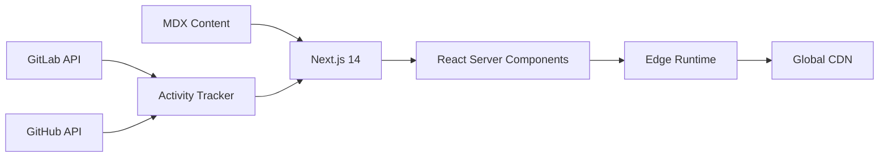

# 🚀 jpinho.com - Engineering Thoughts at Scale

[](https://nextjs.org)
[](https://www.typescriptlang.org)
[](https://tailwindcss.com)
[](https://mdxjs.com)
[](https://vercel.com)

> Distinguished Engineer's thoughts on AI, distributed systems, and the evolving craft of software engineering. Where code meets philosophy, and technical excellence meets business reality.

## 🎯 Philosophy

This blog is my digital garden where I explore the intersection of:
- **AI Engineering** - Building practical AI solutions in traditional industries
- **System Architecture** - Designing systems that scale technically and organizationally
- **Product Engineering** - The mindset beyond code that creates real value
- **Technical Leadership** - Multiplying impact through teams and abstractions

## 🏗️ Architecture

Built with modern web standards and a focus on performance:



### Tech Stack
- **Framework**: Next.js 14 with App Router
- **Language**: TypeScript (strict mode, no compromises)
- **Styling**: Tailwind CSS + CSS Variables for theming
- **Content**: MDX for rich, interactive blog posts
- **Deployment**: Vercel Edge Network
- **Analytics**: Privacy-first, GDPR compliant

## ⚡ Features

### For Readers
- 🌓 **Dark/Light Mode** - Easy on the eyes, always
- 📱 **Responsive Design** - From mobile to 4K displays
- 🔍 **Full-Text Search** - Find what you need, fast
- 🏷️ **Tag System** - Navigate by topics
- 📊 **Reading Time** - Know your time investment
- 🎯 **Featured Posts** - Curated best content

### For Developers
- 💯 **100% TypeScript** - Type safety everywhere
- 🚄 **Optimized Performance** - Sub-second page loads
- 🎨 **Component Library** - Reusable, accessible components
- 📝 **MDX Support** - Write rich content with React components
- 🔄 **Git Activity Integration** - Real-time contribution graphs
- 🧪 **Testing Ready** - Jest + React Testing Library setup

## 🛠️ Local Development

### Prerequisites
- Node.js 20+
- npm 10+
- Git

### Quick Start

```bash
# Clone the repository
git clone https://github.com/jpinho/my-blog.git
cd my-blog

# Install dependencies
npm install

# Set up environment variables (optional)
cp .env.example .env.local

# Run development server
npm run dev

# Open http://localhost:3000
```

### Available Scripts

```bash
npm run dev          # Start development server
npm run build        # Create production build
npm run start        # Start production server
npm run lint         # Run ESLint
npm run type-check   # TypeScript validation
npm run format       # Prettier formatting
```

## 📝 Writing Posts

### Creating a New Post

1. Create a new MDX file:
```bash
touch src/content/blog/2025/my-new-post.mdx
```

2. Add frontmatter:
```mdx
---
title: "Your Brain is a Biased Compiler"
date: "2025-01-15"
excerpt: "Exploring cognitive biases in engineering decisions"
author: "João Pinho"
tags: ["cognitive-science", "engineering", "decision-making"]
featured: true
---

Your content here...
```

3. Add images to `public/images/blog/`

4. Use React components in MDX:
```mdx
<YouTubeEmbed videoId="dQw4w9WgXcQ" />
```

## 🎨 Customization

### Theme Configuration
Edit `src/styles/globals.css` for color schemes:

```css
:root {
  --color-primary: #6366f1;    /* Indigo */
  --color-secondary: #8b5cf6;  /* Purple */
  --color-accent: #ec4899;     /* Pink */
}
```

### Site Configuration
Update `src/lib/config.ts`:

```typescript
export const siteConfig = {
  name: "Pinho",
  url: "https://jpinho.com",
  author: "João Pinho",
  description: "Distinguished Engineer @ epilot",
  // ...
}
```

## 📊 Performance

Lighthouse scores on production build:

- ⚡ **Performance**: 100
- ♿ **Accessibility**: 100
- 📋 **Best Practices**: 100
- 🔍 **SEO**: 100

### Optimizations
- Static generation at build time
- Automatic image optimization
- Font subsetting and preloading
- Minimal JavaScript bundles
- Edge caching with proper headers

## 🤝 Contributing

While this is a personal blog, I welcome:
- 🐛 Bug reports
- 💡 Feature suggestions
- 📝 Typo corrections
- 🌐 Translation help

Please open an issue first to discuss changes.

## 📄 License

Content is © João Pinho, all rights reserved.
Code is MIT licensed - feel free to fork and adapt for your own blog!

## 🔗 Connect

- **Blog**: [jpinho.com](https://jpinho.com)
- **GitHub**: [@jpinho](https://github.com/jpinho)
- **GitLab**: [@j.pinho](https://gitlab.com/j.pinho)
- **LinkedIn**: [João Pinho](https://linkedin.com/in/joaopinho)
- **Twitter**: [@jpinho](https://twitter.com/jpinho)
- **Strava**: [Endurance Journey](https://strava.com/athletes/101563636)

## 🙏 Acknowledgments

Built on the shoulders of giants:
- The Next.js team for an incredible framework
- Vercel for seamless deployment
- The open source community for countless packages
- My readers for the motivation to keep writing
- [Peter Steinberger](https://steipete.com) for the Blog & Work inspiration and setting the bar for technical blogs

---

<div align="center">
  <i>Building software to help humans, one commit at a time.</i>
  <br>
  <br>
  <b>🏃‍♂️ Ironman 70.3 Finisher | 👨‍👧 Father | 🧠 AI Advocate | 🏗️ Platform Builder</b>
</div>